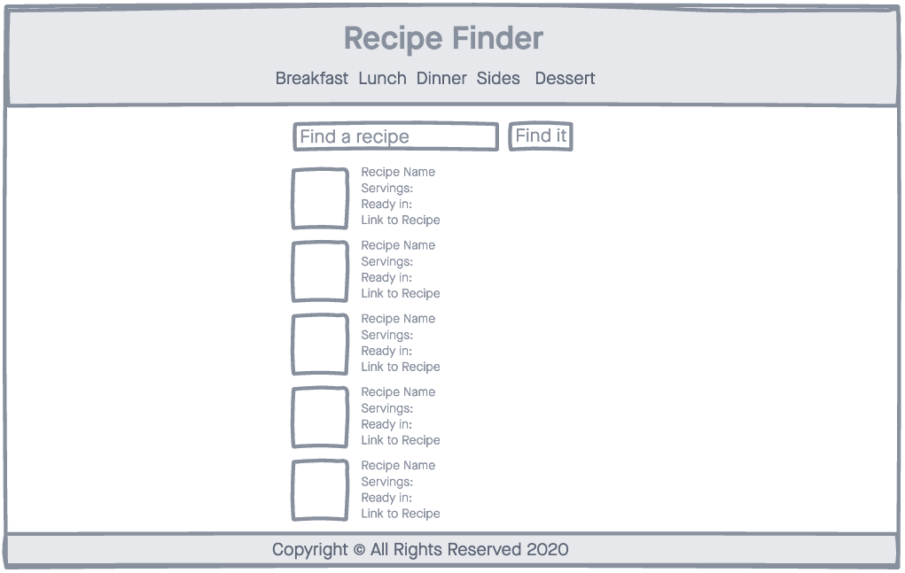
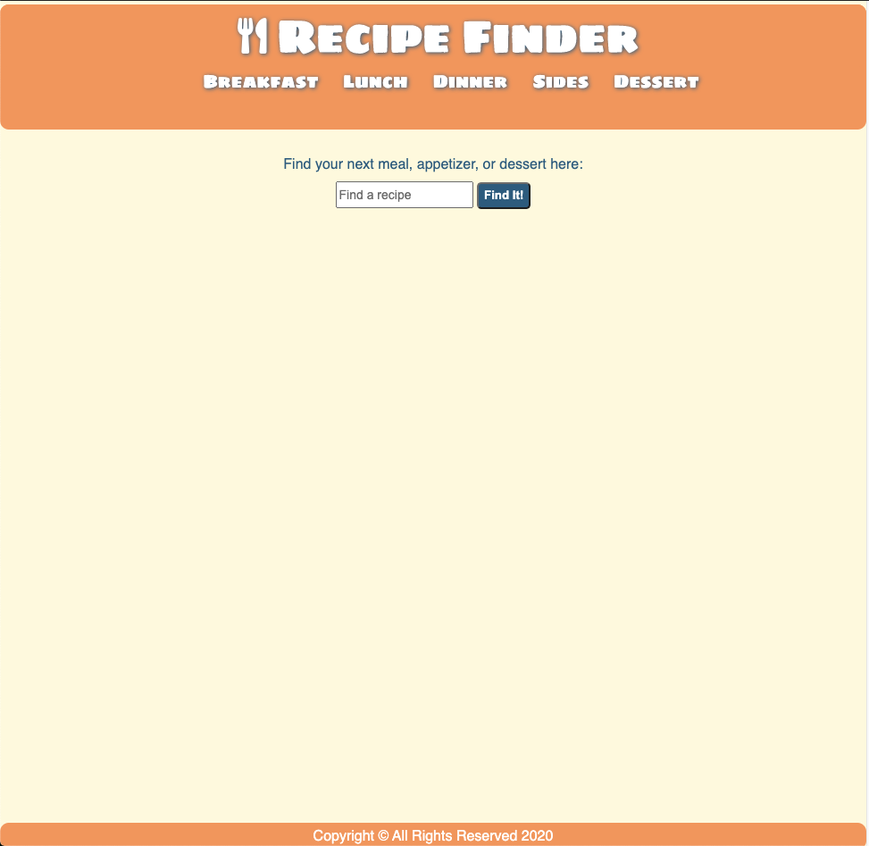
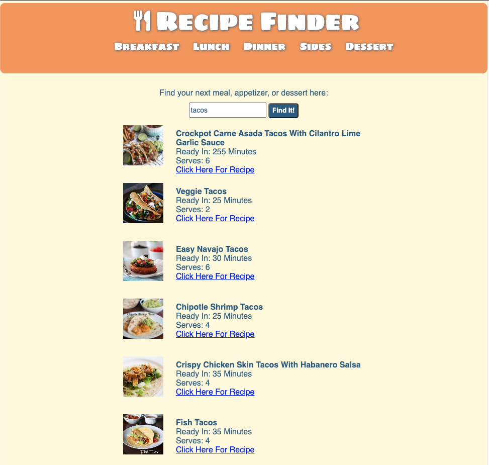

# Recipe Finder

A simple web application that allows you to search for recipes

## Technologies Used:
- HTML5
- CSS3
- JavaScript
- jQuery
- Google Fonts
- Font Awesome
- Spoonacular API

## Wireframe:

## Screenshots of Webpage:

## Getting Started:
- [Click Here](https://cabbycab.github.io/Recipe-Search-App/) to see the deployed app!
- Just type in a type of food and 10 items will populate.
- You can also click on a category in the navigation bar and it will take you to a page with multiple recipes.   

## Next Steps:
Be able to display more results by adding a Next Page button. 